<div align="center">

# kindify — Toxic Comment Detection with Guarded Polite Rewrites

**kindify is a comment moderation kit for community teams and researchers. It takes a comment through these steps to a label score and, if necessary, a checked polite rewrite:**

`classify` → `compare with the threshold` → `rewrite` → `guard` → `fall back` → `collect opt-in feedback`.


**[Summary](#1-summary)** ·
**[Workflow](#4-the-end-to-end-workflow)** ·
**[Run it](#10-how-to-run-kindify)** ·
**[Configuration](#104-environment-variables)** ·
**[Known problems](#13-known-problems)** ·
**[Glossary](#15-glossary)**

</div>

> [!NOTE]
> This README uses ASD-STE100 Simplified Technical English. The writing rules and the project
> vocabulary are in [`docs/ste-style-guide.md`](docs/ste-style-guide.md). Each term in the
> [Glossary](#15-glossary) has only one meaning.

---

> [!WARNING]
> Do not use kindify as an automatic moderation decision. A person must review each flagged comment and each rewrite.
> Toxicity models make more false alarms on comments that mention some identity groups. Read the bias table of your run.

kindify classifies a comment for the 6 Jigsaw labels and compares the toxicity score with a threshold from validation data.
If the comment is toxic, a rewriter makes a polite version. Five guards check the rewrite before anyone sees it.
An LLM rewrite that fails, times out or repeats its prompt is replaced by a rule rewrite, or by no rewrite.
Each metric in the evaluation is a real measurement at the natural toxic share.

This README is the **one location that explains all of kindify**. It gives these topics:

- the general design
- each component and its procedure, step by step
- the decision rules
- the data map
- the runbook
- the validation results and the known problems

| If you are… | Read |
|---|---|
| A manager or reviewer | [1](#1-summary), [3](#3-design-rules), [4](#4-the-end-to-end-workflow), [12](#12-validation-results), [14](#14-key-points) |
| A developer who joins the project | All sections, in sequence. Keep [10](#10-how-to-run-kindify) and [13](#13-known-problems) open while you work |
| An operator who runs kindify | [10](#10-how-to-run-kindify), then the section for the component that you use |

---

## Table of contents

1. 🧭 [Summary](#1-summary)
2. 🏗️ [How kindify is built](#2-how-kindify-is-built)
   - 2.1 [Components](#21-components)
   - 2.2 [System context](#22-system-context)
   - 2.3 [Repository layout](#23-repository-layout)
3. 🛡️ [Design rules](#3-design-rules)
4. 🔄 [The end-to-end workflow](#4-the-end-to-end-workflow)
   - 4.1 [Full flow](#41-full-flow)
   - 4.2 [The life cycle of one comment](#42-the-life-cycle-of-one-comment)
   - 4.3 [Who does which step](#43-who-does-which-step)
5. 🔵 [The classifiers and their evaluation](#5-the-classifiers-and-their-evaluation)
6. 🟢 [The rewriters and the guards](#6-the-rewriters-and-the-guards)
7. 🟣 [The service, the API and the feedback store](#7-the-service-the-api-and-the-feedback-store)
8. ⚖️ [The decision rules and the metrics](#8-the-decision-rules-and-the-metrics)
9. 🗂️ [Data and file map](#9-data-and-file-map)
10. ▶️ [How to run kindify](#10-how-to-run-kindify)
    - 10.1 [Prerequisites](#101-prerequisites) · 10.2 [Installation](#102-installation) · 10.3 [Run kindify](#103-run-kindify) · 10.4 [Environment variables](#104-environment-variables)
11. 🧩 [How to extend kindify](#11-how-to-extend-kindify)
12. ✅ [Validation results](#12-validation-results)
13. ⚠️ [Known problems](#13-known-problems)
14. 📌 [Key points](#14-key-points)
15. 📖 [Glossary](#15-glossary)
16. 📄 [License](#16-license)

---

## 1. Summary

**The problem.** A community team wants to find toxic comments and offer a polite version. These questions are difficult:

- How good is the classifier when only about 10 % of comments are toxic?
- Does the classifier make more false alarms on comments that mention an identity group?
- How do you stop an LLM rewrite that repeats its own prompt or loses the comment?
- How do you know that a rewrite is less toxic and keeps the meaning?
- How do you collect feedback without storing private text with no consent?

kindify gives each of these questions its own component. Each component has a small interface and an offline implementation.

| Item | Value |
|---|---|
| Input | A comment, or a labelled CSV in the Jigsaw layout |
| Output | Label scores, a toxic decision, a guarded rewrite or none, notes. A run folder after training |
| Components | **14** modules: config, data, classifier, transformer_model, evaluate, rewrite (prompts, rewriters, guards), detox_eval, service, feedback, api, experiment, cli |
| Classifiers | TF-IDF with logistic regression (core). Transformer with a multi-label head (extra `transformers`) |
| Rewriters | Rules (core), any OpenAI-compatible chat server, a local HF chat model (extra `transformers`) |
| Offline mode | Training, evaluation, moderation and rewrite evaluation with the TF-IDF classifier and the rule rewriter |
| Safety | Five guards on each rewrite, a time limit with a fallback, opt-in feedback with redaction and retention |
| Tests | **28** unit tests pass in CI (`pytest`), 3 skip without the extras. With the extras, 31 pass |

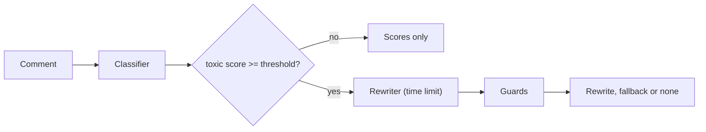

---

## 2. How kindify is built

### 2.1 Components

| Component | Module | Purpose |
|---|---|---|
| Settings | `src/kindify/config.py` | Environment variables and a local `.env` loader |
| Data | `src/kindify/data.py` | Jigsaw loaders, natural-prevalence splits, identity terms, truncation report, synthetic comments |
| TF-IDF classifier | `src/kindify/classifier.py` | Word and character TF-IDF, one logistic regression for each label, `logits_to_proba` |
| Transformer classifier | `src/kindify/transformer_model.py` | Optional. Lazy imports, 256 tokens, sigmoid probabilities |
| Evaluation | `src/kindify/evaluate.py` | Per-label AUCs, threshold, identity bias metrics, language table |
| Prompts | `src/kindify/rewrite/prompts.py` | Chat messages. Examples are dropped before the comment |
| Rewriters | `src/kindify/rewrite/rewriters.py` | Rule, OpenAI-compatible and HF chat rewriters |
| Guards | `src/kindify/rewrite/guards.py` | Prompt echo, re-classification, similarity, length |
| Detox evaluation | `src/kindify/detox_eval.py` | STA, SIM, J (STA × SIM), prompt echo share |
| Service | `src/kindify/service.py` | Lazy loading, time limit, fallback, run folder I/O |
| Feedback | `src/kindify/feedback.py` | SQLite store with consent, redaction, retention, preference export |
| API | `src/kindify/api.py` | Optional FastAPI app: `/health`, `/moderate`, `/feedback` |
| Experiment | `src/kindify/experiment.py` | Train, evaluate, rewrite evaluation, model card |
| CLI | `src/kindify/cli.py` | The `kindify` command with 6 subcommands |

The component map shows which module calls which module. An arrow points from the caller to the module that it uses.

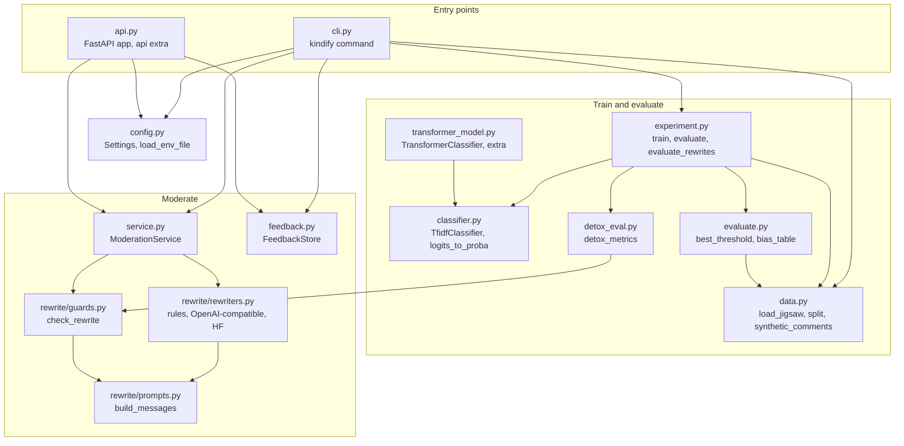

### 2.2 System context

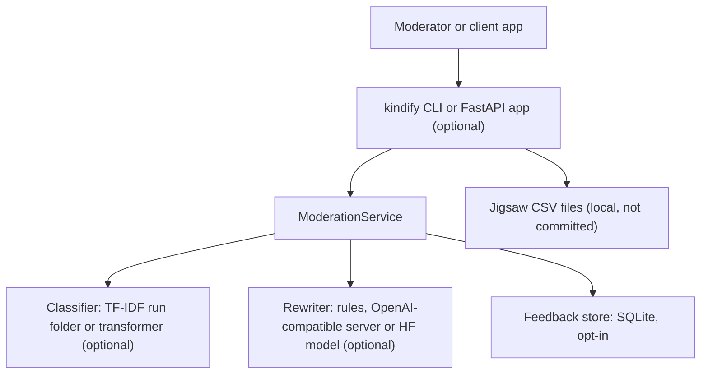

### 2.3 Repository layout

```
kindify/
├── .github/workflows/ci.yml        # CI: Python 3.11, pip install -e ".[dev]", pytest -q
├── .env.example                    # 16 environment variables, all values empty
├── pyproject.toml                  # package, extras (transformers, embeddings, api, all, dev), kindify script
├── data/README.md                  # sources, terms, columns
├── docs/ste-style-guide.md         # writing rules and project vocabulary
├── src/kindify/
│   ├── config.py  data.py          # settings, loaders, splits, synthetic comments
│   ├── classifier.py  transformer_model.py  evaluate.py
│   ├── rewrite/                    # prompts.py, rewriters.py, guards.py
│   ├── detox_eval.py  service.py  feedback.py  api.py
│   └── experiment.py  cli.py
└── tests/                          # 31 tests: 3 need torch + transformers or fastapi
```

---

## 3. Design rules

### 3.1 Evaluate at the natural toxic share
`split` keeps the real share of toxic comments in the validation and test parts. The classifier uses class weights instead of undersampling. With the official Jigsaw test files, the loader drops the rows with the label `-1`.

### 3.2 Choose the threshold on validation data
`best_threshold` selects the threshold with the highest F1 on the validation part. The test part is scored one time with that threshold.

### 3.3 Measure identity bias
`bias_table` gives the subgroup AUC, the BPSN AUC and the BNSP AUC for each identity term. A placeholder bias number does not exist in kindify.

### 3.4 Never show the prompt
The OpenAI-compatible rewriter reads only the reply message. The HF rewriter decodes only the new tokens. The guards refuse a rewrite that repeats the system prompt or a few-shot example.

### 3.5 Never cut the comment
`build_messages` drops few-shot examples first. If the comment alone is too long, it raises `CommentTooLong`, and the service gives no LLM rewrite. The rule rewriter then tries.

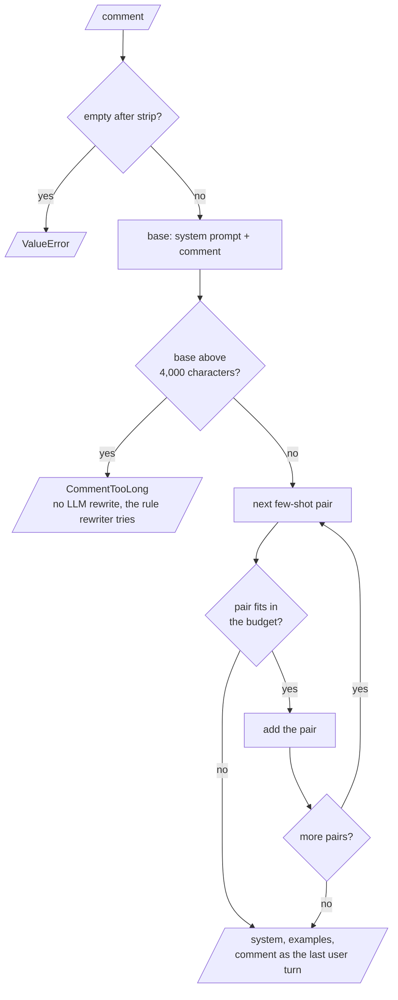

### 3.6 Load late and limit time
The service loads the classifier on the first request. Each rewrite has a time limit (`KINDIFY_TIMEOUT_S`). After a timeout, the service uses the rule rewriter.

### 3.7 Store feedback only with consent
The store refuses a row without consent. It redacts personal data and deletes rows after the retention period.

### 3.8 Prototype problems and their fixes

| # | Problem in the earlier prototype | Fix in kindify |
|---|---|---|
| 1 | A 50/50 test set and one label | Natural-prevalence splits, the official test labels, all 6 labels |
| 2 | Inputs cut at 64 or 32 tokens | 256 tokens for the transformer and a truncation report |
| 3 | "Multilingual" models tested on English only | A language table when the data has a `lang` column |
| 4 | The prompt came back in rewrites | Reply-only decoding, new-token decoding and a prompt-echo guard |
| 5 | The comment was at the end of a prompt cut at 512 tokens | Examples are dropped first. A long comment raises `CommentTooLong` |
| 6 | A constant bias score and a 5-word "empathy" score | Jigsaw bias metrics, STA, SIM and J. The empathy score is removed |
| 7 | A refinement script that could not run, called RLHF | Opt-in preference pairs and a JSONL export. No RLHF claim |
| 8 | AUC from one raw logit | `logits_to_proba` gives probabilities for all metrics |
| 9 | All models loaded at import, no time limit | Lazy loading, a time limit and a fallback |
| 10 | Raw comments in a CSV with no consent | SQLite store with consent, redaction and retention |

---

## 4. The end-to-end workflow

### 4.1 Full flow

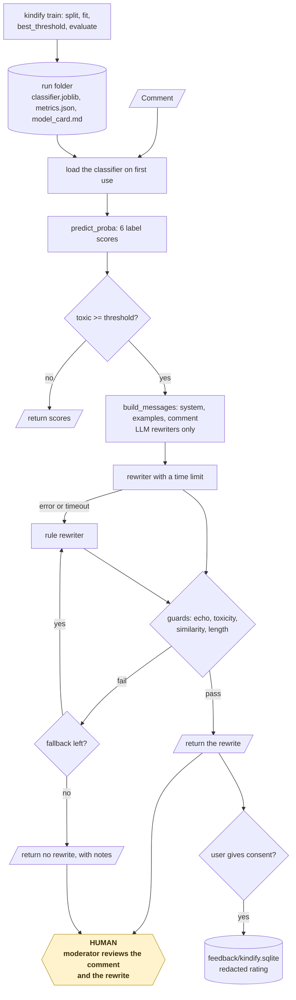

### 4.2 The life cycle of one comment

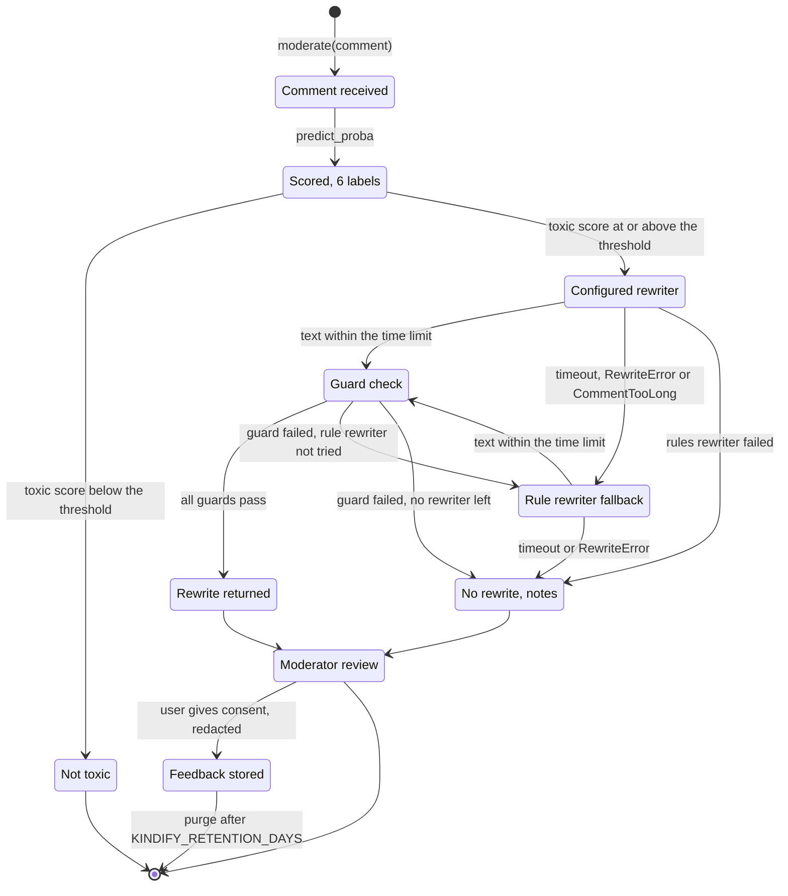

1. The client sends the comment to `ModerationService.moderate`.
2. The service loads the run folder if this is the first request.
3. The classifier gives a probability for each of the 6 labels.
4. If the `toxic` score is below the threshold, the service returns the scores.
5. Else the configured rewriter makes a rewrite within the time limit.
6. The guards check the rewrite. If it fails, the rule rewriter tries.
7. The service returns the first rewrite that passes, or no rewrite and the reasons.
8. If the user gives consent, the client stores a rating or a preference pair.

### 4.3 Who does which step

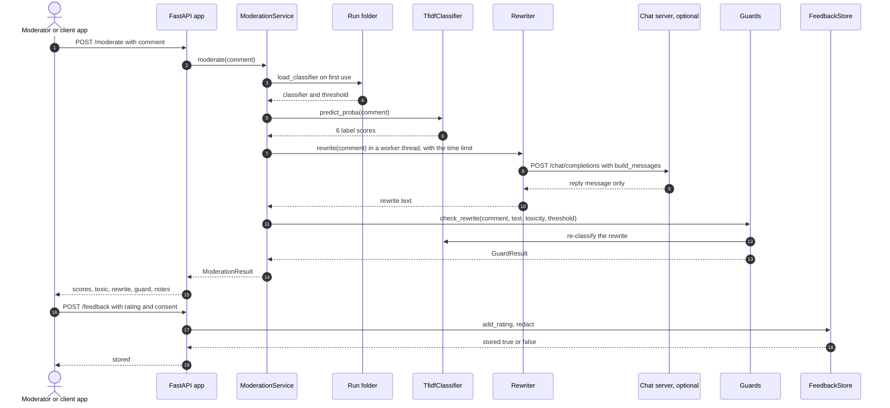

---

## 5. The classifiers and their evaluation

**Purpose.** Score each label with a probability, and measure the classifier honestly.

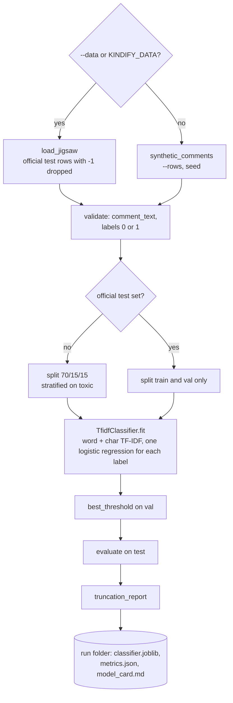

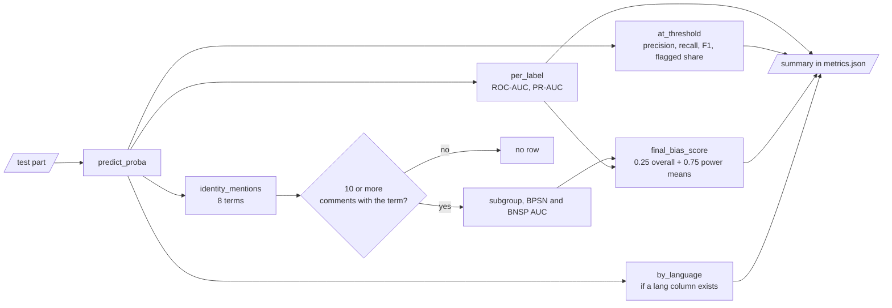

| Classifier | Features and model | Notes |
|---|---|---|
| `TfidfClassifier` | Word 1-2 grams and character 3-5 grams (TF-IDF), logistic regression for each label, `class_weight="balanced"`, C = 4 | A label with one class gets a constant score |
| `TransformerClassifier` | Any `AutoModelForSequenceClassification`, `max_length=256` | Sigmoid for a multi-label head, softmax for a 2-class head |

**Procedure (train)**

1. Split the comments 70/15/15, stratified on `toxic`, with no undersampling.
2. Fit the TF-IDF classifier on the training part.
3. Select the `toxic` threshold with the highest validation F1. If several thresholds tie, use the middle one.
4. Score the test part: ROC-AUC and PR-AUC for each label, precision, recall and F1 at the threshold.
5. Make the bias table, the final bias score and the language table.
6. Write `classifier.joblib`, `metrics.json` and `model_card.md` to the run folder.

**Rules**

- An identity term needs 10 or more test comments to get a row in the bias table.
- A label with no positive test comment gets no AUC.

---

## 6. The rewriters and the guards

**Purpose.** Make a polite version of a toxic comment, and show it only if it passes all guards.

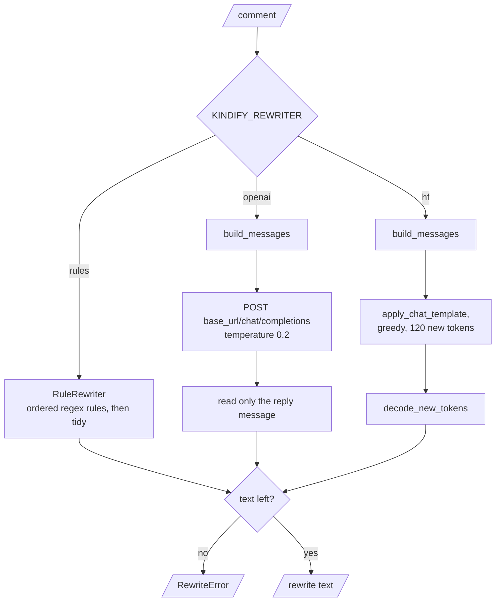

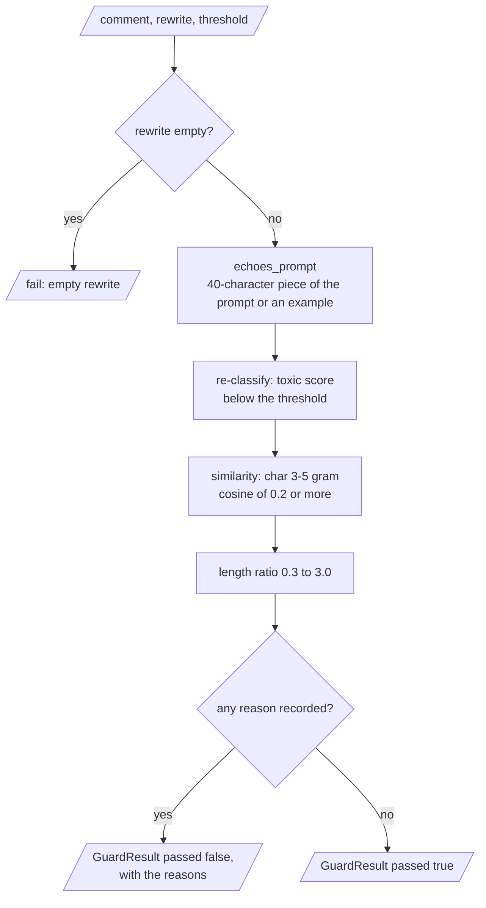

| Rewriter | How it works |
|---|---|
| `RuleRewriter` | Ordered regular-expression rules: insults to "I disagree with you", "shut up" to "please let me finish", threats to "please discuss it on the talk page first", profanity removed |
| `OpenAICompatibleRewriter` | `POST <base_url>/chat/completions` with the chat messages, temperature 0.2. Reads only the reply message |
| `HFChatRewriter` | `apply_chat_template`, greedy generation of 120 new tokens, decodes only the new tokens |

| Guard | Rule |
|---|---|
| Empty | The rewrite must contain text |
| Prompt echo | No 40-character piece of the system prompt or of a few-shot example |
| Toxicity | Re-classified `toxic` score below the threshold |
| Similarity | Character 3-5 gram cosine with the comment of 0.2 or more |
| Length | Rewrite length between 0.3 and 3.0 times the comment length |

**Rules**

- The system prompt tells the model to keep the meaning and the disagreement, and to remove insults, threats and profanity.
- The prompt budget is 4,000 characters. Few-shot examples go before the comment is touched.

---

## 7. The service, the API and the feedback store

**Service.** `ModerationService(loader, rewriter, threshold, timeout_s)` returns a `ModerationResult`: `comment`, `scores`, `toxic`, `threshold`, `rewrite`, `rewriter`, `guard` and `notes`.

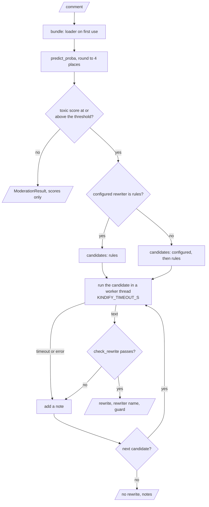

**API (extra `api`).**

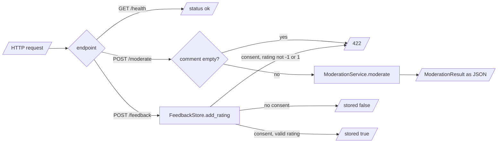

| Endpoint | Body | Result |
|---|---|---|
| `GET /health` | none | `{"status": "ok"}` |
| `POST /moderate` | `{"comment"}` | The `ModerationResult` as JSON. An empty comment gives 422 |
| `POST /feedback` | `{"comment", "rewrite", "rating", "consent"}` | `{"stored": true}` only with consent |

**Feedback store.**

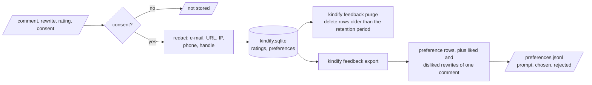

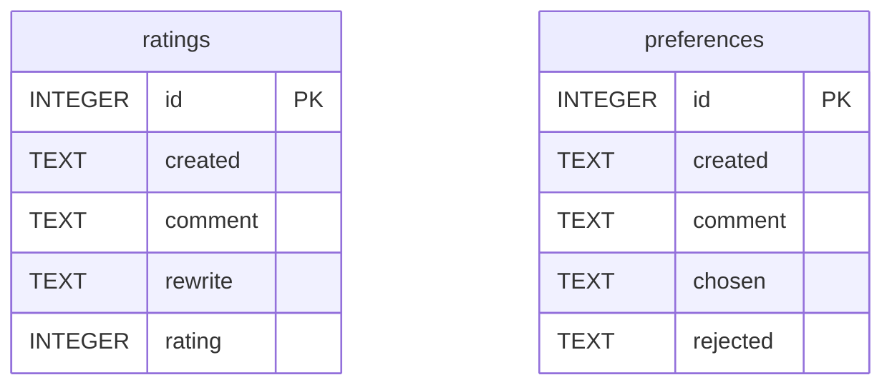

1. Refuse a row without `consent=True`.
2. Replace e-mail addresses, URLs, IP addresses, phone numbers and @handles with placeholders.
3. Store ratings (−1 or 1) and preference pairs (chosen and rejected rewrite).
4. Delete rows older than `KINDIFY_RETENTION_DAYS` with `kindify feedback purge`.
5. Export pairs as `prompt, chosen, rejected` JSON lines. A liked and a disliked rewrite of one comment also make a pair.

kindify does not run a preference fine-tune. The export is the input for a later DPO run.

---

## 8. The decision rules and the metrics

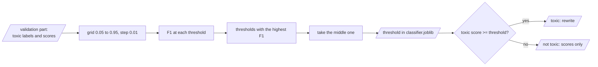

| Rule | Value |
|---|---|
| Toxic decision | `toxic` score at or above the threshold |
| Threshold | Highest validation F1 on the grid 0.05 to 0.95 (step 0.01), middle of ties |
| Rewrite order | Configured rewriter, then the rule rewriter |
| Time limit | `KINDIFY_TIMEOUT_S` for each rewriter call (default 20 s) |

| Metric | Definition |
|---|---|
| ROC-AUC, PR-AUC | For each label, from probabilities, on the test part |
| Subgroup AUC | AUC on the comments that mention the identity term |
| BPSN AUC | Toxic comments without the term and non-toxic comments with it |
| BNSP AUC | Toxic comments with the term and non-toxic comments without it |
| Final bias score | 0.25 × overall AUC + 0.75 × mean of the power means (p = −5) of the three bias AUCs |
| STA | Share of rewrites with a `toxic` score below the threshold |
| SIM | Mean character n-gram cosine between comment and rewrite |
| J (STA × SIM) | Mean of STA_i × SIM_i. Fluency is not in J because the core has no language model |
| Prompt echo share | Share of rewrites that repeat the prompt |

`kindify rewrite-eval` calculates the rewrite metrics. It does not apply the guards.

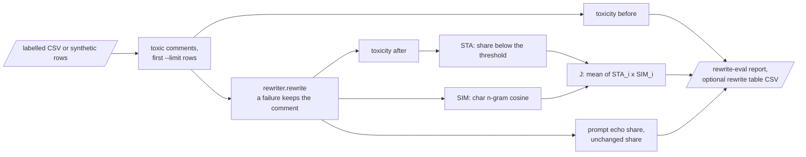

---

## 9. Data and file map

| Path | Committed? | Contents |
|---|---|---|
| `data/README.md` | Yes | Sources, terms and columns |
| `data/*.csv` | No (git ignores it) | Jigsaw files or synthetic comments |
| `runs/<name>/classifier.joblib` | No (git ignores it) | Classifier, threshold and summary |
| `runs/<name>/metrics.json`, `model_card.md` | No (git ignores it) | Evaluation |
| `feedback/kindify.sqlite` | No (git ignores it) | Opt-in feedback |
| `feedback/preferences.jsonl` | No (git ignores it) | Exported preference pairs |
| `.env.example` | Yes | All 16 environment variables, empty |
| `.env` | No (git ignores it) | Local settings and keys |

---

## 10. How to run kindify

### 10.1 Prerequisites

| Need | For |
|---|---|
| Python 3.11+ | All components |
| numpy, pandas, scikit-learn, joblib | Core (installed with the package) |
| Extra `transformers` (torch, transformers) | Transformer classifier and HF rewriter |
| Extra `embeddings` | `detox_eval.embedding_similarity` |
| Extra `api` (fastapi, uvicorn) | The HTTP API |
| An OpenAI-compatible chat server (for example Ollama) | The LLM rewriter (optional) |

### 10.2 Installation

```bash
git clone https://github.com/KrishnaAnnavaram/kindify.git
cd kindify
python -m venv .venv
. .venv/bin/activate            # Windows: .venv\Scripts\activate
pip install -e ".[dev]"         # add ,transformers,api for the optional parts
```

### 10.3 Run kindify

Offline (synthetic comments, rule rewriter):

```bash
kindify train                                         # 8,000 synthetic comments -> runs/latest
kindify moderate "Shut up, idiot. Your football edit is garbage!"
kindify rewrite-eval --limit 200 --out rewrites.csv   # STA, SIM, J on synthetic toxic comments
kindify synth --rows 4000 --out data/synthetic_comments.csv
kindify evaluate data/synthetic_comments.csv
kindify feedback add --comment "..." --rewrite "..." --rating 1 --consent
kindify feedback export --out feedback/preferences.jsonl
kindify feedback purge
```

With the Jigsaw files and an LLM rewriter:

```bash
# .env
KINDIFY_DATA=data/train.csv
KINDIFY_TEST_DATA=data/test.csv
KINDIFY_TEST_LABELS=data/test_labels.csv
KINDIFY_REWRITER=openai
KINDIFY_LLM_BASE_URL=http://localhost:11434/v1
KINDIFY_LLM_MODEL=llama3.2

kindify train --out runs/jigsaw
kindify rewrite-eval --data data/train.csv --run runs/jigsaw --limit 200
uvicorn kindify.api:app --port 8000      # needs the api extra
```

`python -m kindify` is the same as `kindify`. An error prints `error: <message>`, and the exit code is 1.

The diagram shows the order of the commands and the files that connect them.

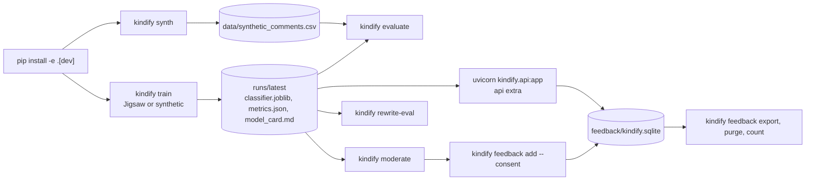

### 10.4 Environment variables

| Variable | Used by | Meaning |
|---|---|---|
| `KINDIFY_DATA` | `train` | Jigsaw `train.csv`. Empty: synthetic comments |
| `KINDIFY_TEST_DATA`, `KINDIFY_TEST_LABELS` | `train` | Official test files. Empty: a 15 % test part |
| `KINDIFY_RUN_DIR` | All model commands | Run folder. Default `runs/latest` |
| `KINDIFY_SEED` | `train`, `rewrite-eval` | Seed. Default 42 |
| `KINDIFY_CLASSIFIER` | Settings check | `tfidf` (default) or `transformer` |
| `KINDIFY_TRANSFORMER_MODEL` | Settings check | Model name or folder. Necessary for `transformer`. No command loads this model yet |
| `KINDIFY_MAX_TOKENS` | Truncation report | Token limit. Default 256 |
| `KINDIFY_REWRITER` | Service | `rules` (default), `openai` or `hf` |
| `KINDIFY_LLM_BASE_URL` | OpenAI-compatible rewriter | Default `http://localhost:11434/v1` |
| `KINDIFY_LLM_MODEL` | OpenAI-compatible rewriter | Default `llama3.2` |
| `KINDIFY_HF_MODEL` | HF rewriter | Instruct model name. Necessary for `hf` |
| `KINDIFY_TIMEOUT_S` | Service | Time limit for each rewriter call. Default 20 |
| `KINDIFY_FEEDBACK_DB` | Feedback store | Default `feedback/kindify.sqlite` |
| `KINDIFY_RETENTION_DAYS` | Feedback store | Default 30 |
| `OPENAI_API_KEY` | OpenAI-compatible rewriter | Only for a hosted server. A local server needs no key |

The CLI reads `--env-file` (default `.env`) first. A variable that is already set is not replaced.
Credentials are only in a local `.env` file. Git ignores this file. Do not print or commit credentials.

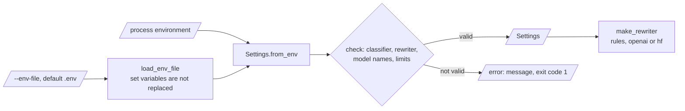

---

## 11. How to extend kindify

| You want to… | Do this | Code change? |
|---|---|---|
| Use an LLM rewriter | Set `KINDIFY_REWRITER=openai` and the server URL and model | No |
| Use a local instruct model | Install `.[transformers]`, set `KINDIFY_REWRITER=hf` and `KINDIFY_HF_MODEL` | No |
| Add identity terms | Add them to `IDENTITIES` in `data.py` | Small |
| Add a guard | Add a check and a reason in `check_rewrite` | Small |
| Fine-tune a transformer | Use `transformer_model.new_model` with the Hugging Face `Trainer` | Yes |
| Train the rewriter on feedback | Export pairs, then run a DPO fine-tune outside kindify | Yes |

Planned milestones (not built): a transformer training command, a fluency score with a small language model, ParaDetox evaluation and a Gradio front end.

---

## 12. Validation results

| Validation | Result | Command |
|---|---|---|
| Unit tests (CI installs only `.[dev]`) | **28 passed**, 3 skipped (`torch`, `transformers` and `fastapi` absent) | `pytest -q` |
| Unit tests with the extras `transformers` and `api` | **31 passed**. The transformer tests use a tiny model that the tests make | `pip install -e ".[dev,transformers,api]"`, `pytest -q` |
| Synthetic classifier, `toxic`, test part (1,200 comments, 13.9 % toxic) | ROC-AUC 0.959, PR-AUC 0.931, threshold 0.42, precision 0.974, recall 0.892, F1 0.931 | `kindify train` |
| Synthetic bias | BPSN AUC 0.923 for `man` and 0.928 for `white`. Final bias score 0.981 | `kindify train` |
| Synthetic rule rewrites (200 toxic comments) | STA 0.815, SIM 0.645, J (STA × SIM) 0.542, prompt echo 0.0 | `kindify rewrite-eval` |

All synthetic numbers use seed 42. The synthetic toxic comments include 2 % flipped labels, so 10 % of the evaluated "toxic" comments are benign and stay unchanged.
The rule rewriter was written for the synthetic sentence patterns. Its STA on real comments will be lower. Measure it with `rewrite-eval` on your data.
No result on the real Jigsaw files is in this README. The earlier prototype reported scores on a 50/50 test set (prototype result, not reproduced here).

---

## 13. Known problems

Read these problems before you use kindify in production.

| # | Area | Problem | Impact and action |
|---|---|---|---|
| 1 | Data | No real Jigsaw result is in CI | Train on the Jigsaw files and read the model card before use |
| 2 | Rule rewriter | The rules cover a small set of insults and phrases | Use an LLM rewriter for real comments, with the guards on |
| 3 | Fluency | J has no fluency term in the core package | Add a language-model score, or read a sample of rewrites |
| 4 | Similarity | Character n-gram similarity is a weak test of meaning | Use `embedding_similarity` (extra `embeddings`) for a stronger check |
| 5 | Bias | The identity list has 8 English terms | Add terms for your community. Report the BPSN AUC for each |
| 6 | Languages | The TF-IDF model knows only the training languages | Add a `lang` column and read the language table |
| 7 | Transformer training | No training command for the transformer | Fine-tune with the Hugging Face `Trainer`, then load the folder |
| 8 | Timeouts | A slow LLM call keeps running in a background thread after the time limit | Set a server-side limit too |
| 9 | Feedback | Redaction uses patterns. Names and addresses in free text stay | Tell users not to enter personal data |

**Responsible use.** kindify is not an automatic moderation or enforcement tool. A person must review flagged comments and rewrites. Training data has label noise and bias: comments that mention identity groups get more false alarms. A rewrite is a suggestion. Do not publish it as the words of the user without consent.

---

## 14. Key points

1. **Evaluation uses the natural toxic share.** No test comment is removed to balance the classes.
2. **Bias is measured, not invented.** Subgroup, BPSN and BNSP AUCs replace a constant.
3. **The prompt never reaches the user.** Reply-only decoding and a prompt-echo guard stop it.
4. **Each rewrite passes five guards.** A failed rewrite is replaced by a rule rewrite or by none.
5. **Feedback needs consent.** The store redacts, expires rows and exports preference pairs.
6. **The full demo runs offline.** 28 tests run in CI without a download, a key or a network.

---

## 15. Glossary

| Term | Meaning |
|---|---|
| **BNSP AUC** | AUC on toxic comments with the term and non-toxic comments without it |
| **BPSN AUC** | AUC on toxic comments without the term and non-toxic comments with it |
| **Classifier** | A model that gives a probability for each label |
| **Comment** | One user text that kindify classifies |
| **Fallback** | The rule rewriter that the service uses when the LLM fails |
| **Feedback store** | The SQLite file with ratings and preference pairs |
| **Guard** | One check that a rewrite must pass |
| **Identity term** | A word that names an identity group, for example `muslim` |
| **Label** | One of the 6 Jigsaw classes |
| **Natural prevalence** | The real share of toxic comments |
| **Preference pair** | A comment with a chosen and a rejected rewrite |
| **Prompt echo** | A rewrite that repeats the prompt |
| **Rewrite** | The polite text that a rewriter gives |
| **Rewriter** | A class that makes a rewrite |
| **SIM** | Character n-gram cosine between comment and rewrite |
| **STA** | Share of rewrites below the threshold |
| **Threshold** | The toxicity score at or above which a comment is toxic |
| **Toxicity score** | The probability of the `toxic` label |

---

## 16. License

[MIT](LICENSE) © 2026 Krishna Annavaram
